## Основная информация

- **Название ПО:** Protein Imager
- **Сайт ПО:** https://3dproteinimaging.com/protein-imager/
- **Структура белка:** 1EMA
- **Источник структуры:** https://www.rcsb.org/structure/1EMA

## Краткое описание

**Protein Imager** - веб-приложение для визуализации молекулярных структур белков с интуитивно понятным интерфейсом и возможностью создания публикационных изображений.

## Визуализация структуры

*Визуализация выбирается на правой боковой панели*

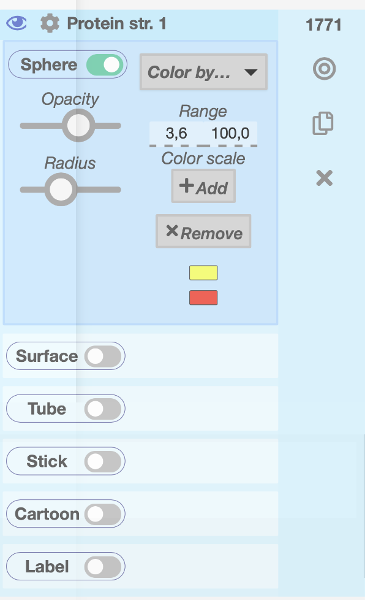

### a. Wireframe - Stick
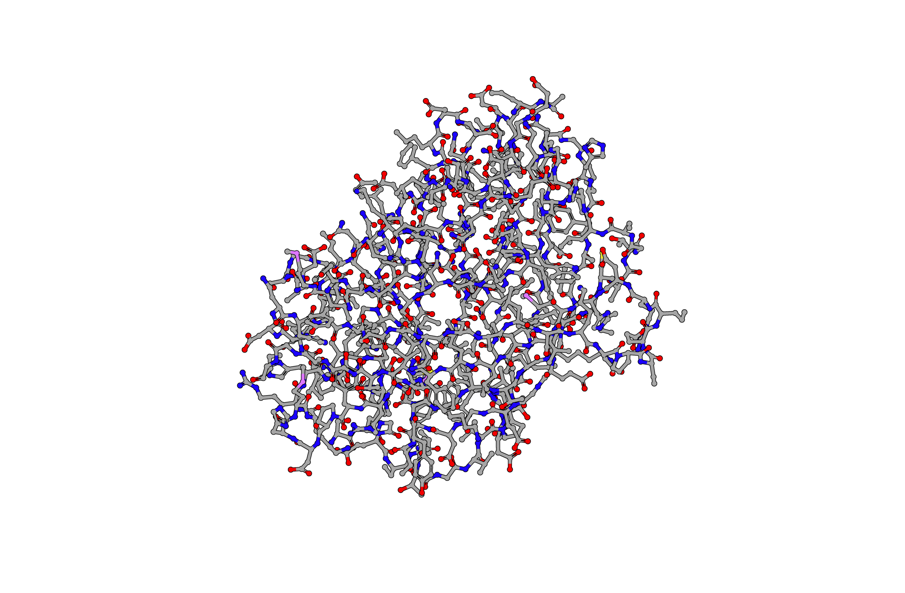

### b. Backbone - Tube
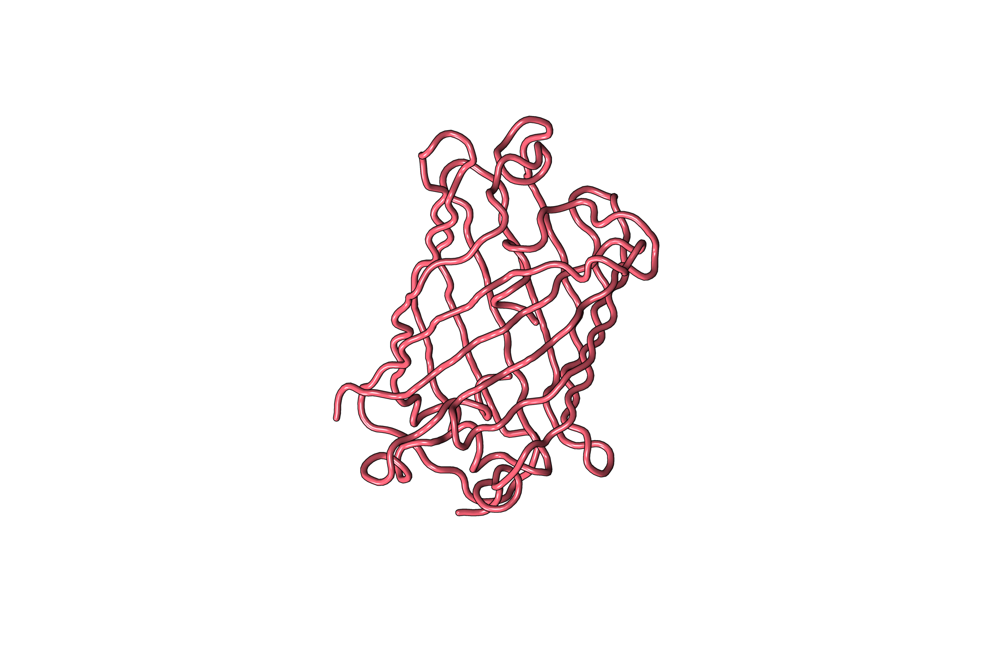

### c. Spacefill - Sphere
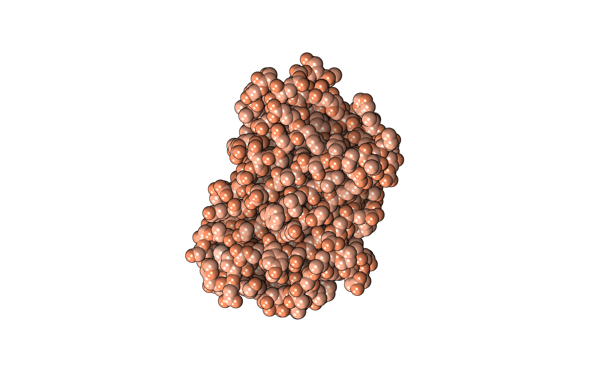

### d. Ribbons - Cartoon
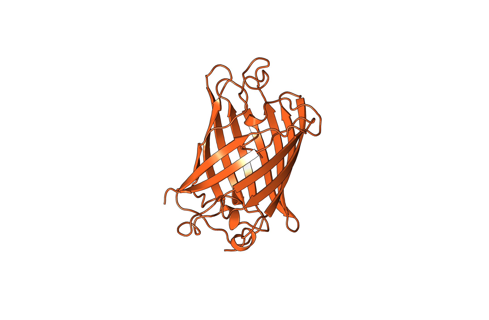

### e. Molecular surface - Surface
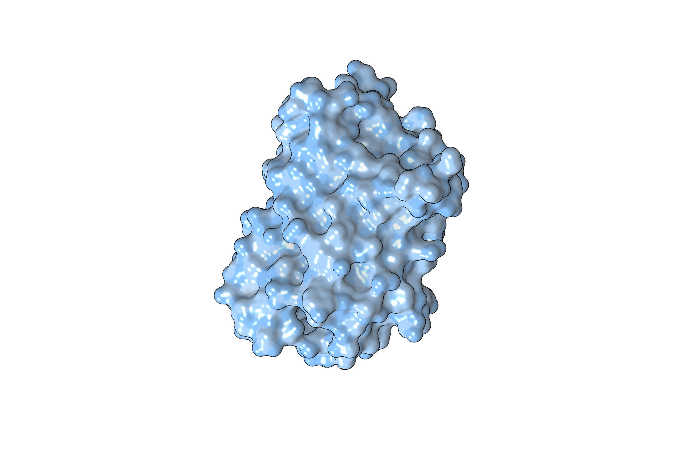

## Раскраска структуры

### a. Цветовая модель CPK
*Выбрана цветовая схема color by Element*

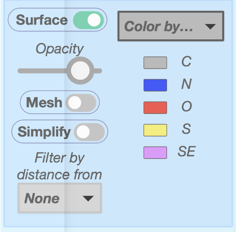
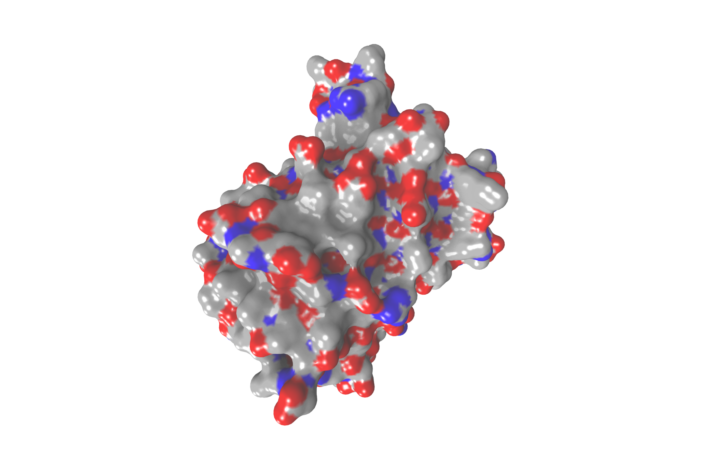

### b. Различные цвета по доменам белка
*В правой панели отображаются части*

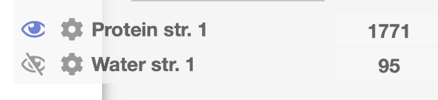
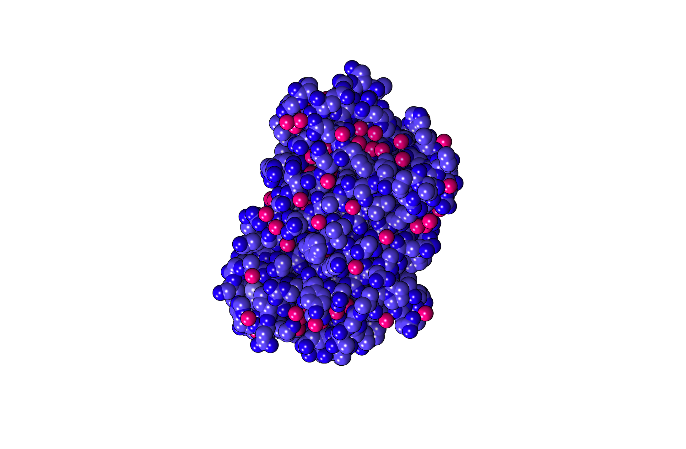

## Публикационное качество

*Доступен экспорт в высоком качестве*

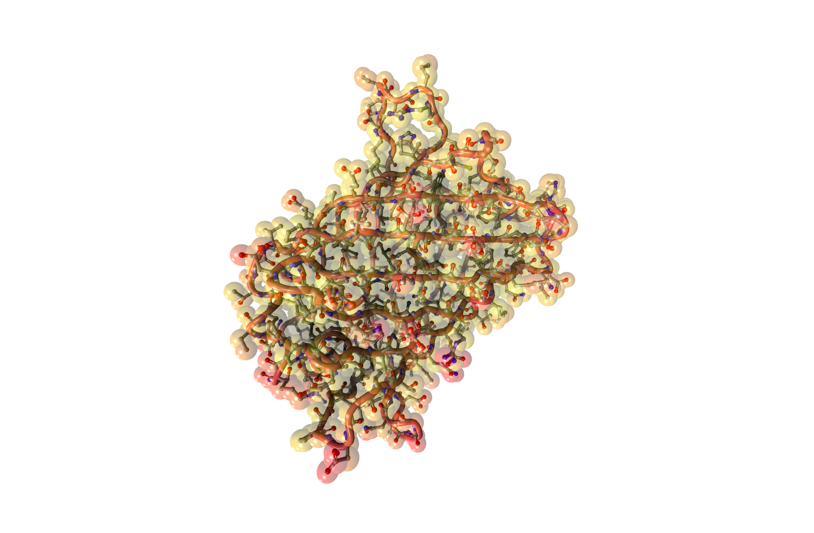
