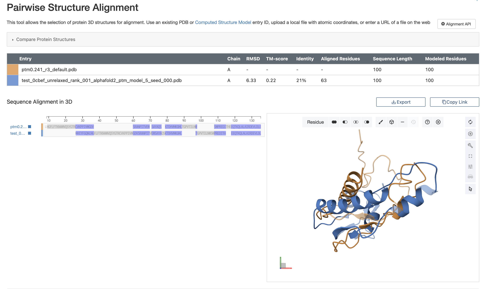
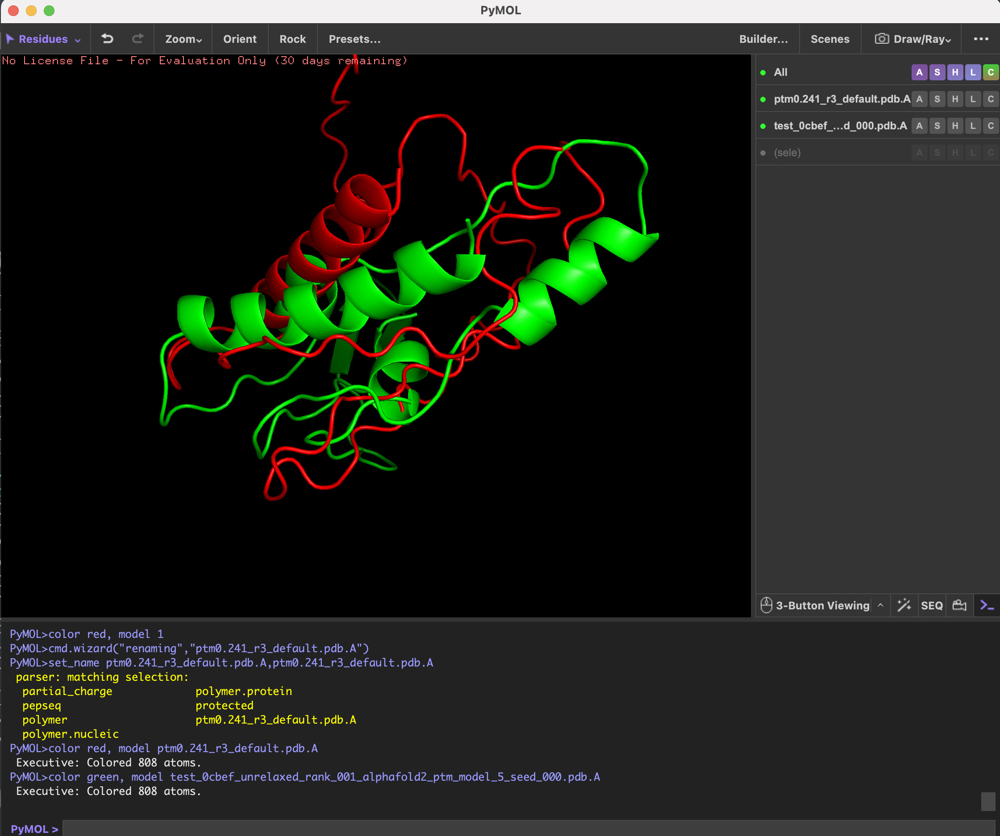

# ДЗ 5

## 1. Последовательность и предсказание структур

Рассматриваем последовательность:  

`MVEYFGQNLNGFLFTKNAWVQSYGTRCVKPPIVWGDVSRANPITVEWSAYAQSKTDHVMKGMLTGPVTILNWSWPREDITHEEQTKQLALAIRDEVLDLE`

Используем программы ESMFold и AlphaFold2.  

**Ноутбуки:**

* [ESMFold.ipynb](./colab/ESMFold.ipynb)  
* [AlphaFold2.ipynb](./colab/AlphaFold2.ipynb)  

**Полученные файлы структур:**

* [ptm0.241_r3_default.pdb](./colab/ptm0.241_r3_default.pdb) (ESMFold)  
* [test_0cbef_unrelaxed_rank_001_alphafold2_ptm_model_5_seed_000.pdb](./colab/test_0cbef_unrelaxed_rank_001_alphafold2_ptm_model_5_seed_000.pdb) (AlphaFold2)  

---

## 2-3. Выравнивание структур

Для выравнивания использовали программу [RCSB Alignment](https://www.rcsb.org/alignment) и инструмент jCE.  

**Результаты:**

* Папка с выравниванием: [./jCE](./jCE)  
* Скриншот выравнивания:   

---

## 4–5. Визуализация

Для визуализации структур использован PyMOL.  

**Результат:**  
  

---

## 6. Интерпретация результатов

Структурное выравнивание моделей ESMFold и AlphaFold2 показывает значительные различия:

* **Identity = 21%** - низкая идентичность.  
* **Aligned residues = 63/100** - выровнялась только часть белка.  

**Вывод:**  
Модели ESMFold и AlphaFold2 дают существенно различные предсказания трёхмерной структуры белка.
