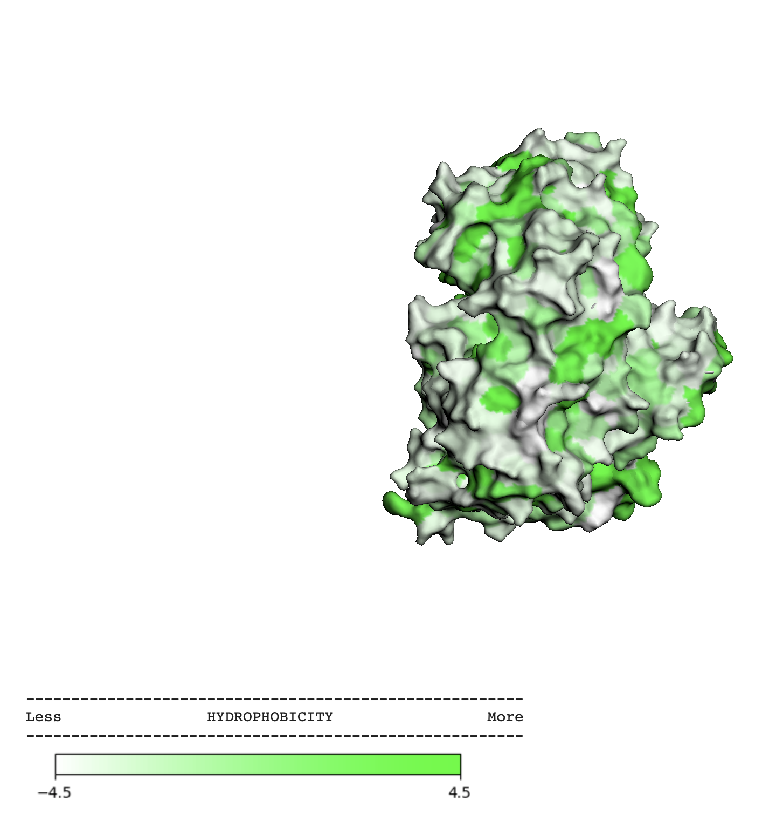
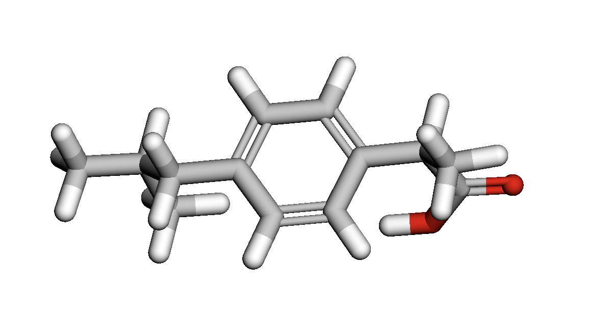
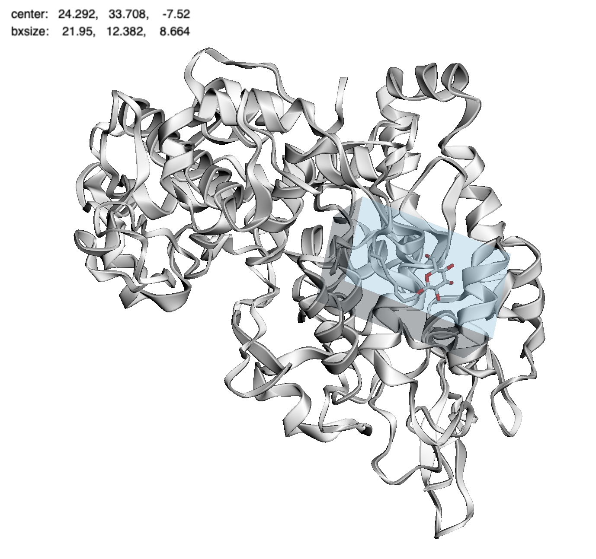
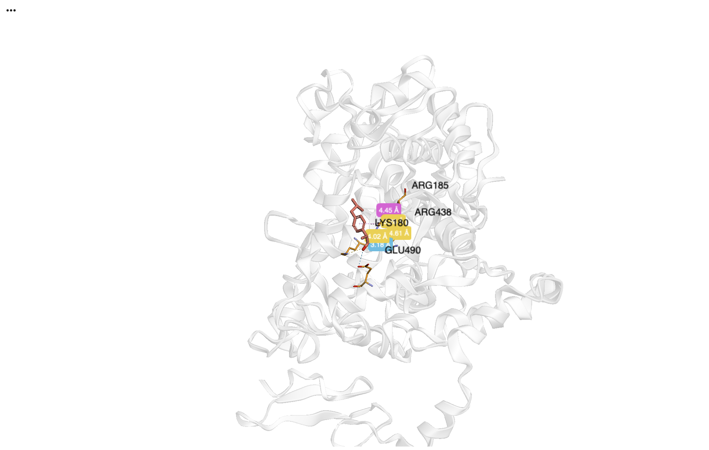

# 1. Информация о препарате

a. Действующее вещество
Действующее вещество: ибупрофен
Это одно и то же: коммерческое название и название молекулы совпадают.

b. Область применения
Ибупрофен используется для снижения температуры, уменьшения боли (головная, зубная, мышечная, суставная и др.), уменьшения воспаления (травмы, артрит и т.п.).
Он относится к группе НПВС(нестероидные противовоспалительные средства).

c. Молекулярный механизм действия (простыми словами)

В организме есть ферменты COX-1 и COX-2, которые помогают превращать жирные кислоты в вещества, называемые простагландины.

Простагландины усиливают воспаление, боль и температуру.

Ибупрофен садится в активный центр COX-2 и не даёт ферменту работать.

В результате образуется меньше простагландинов, то есть меньше боли, меньше воспаления и нормализуется температура.

# 2. Ноутбук

[ссылка]

# 3. Результат докинга

[ссылка]

# 4. Изображения

